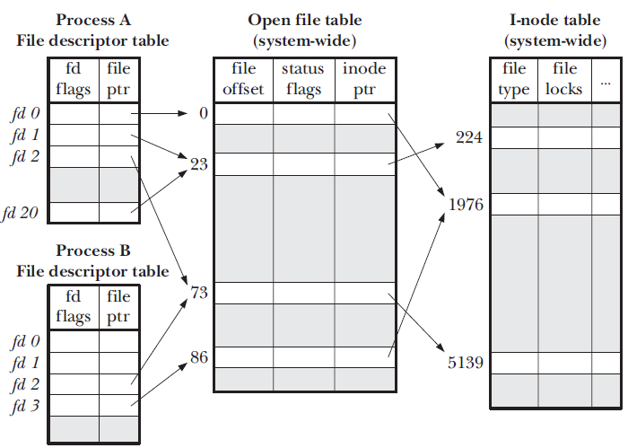
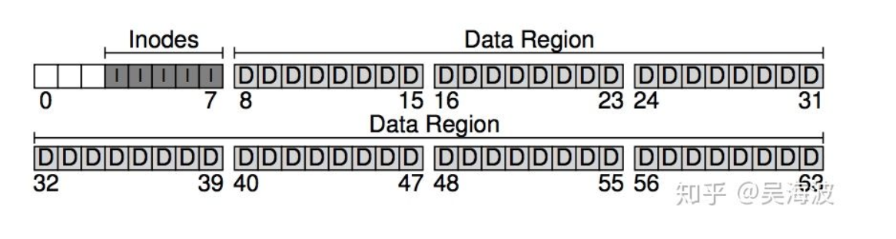
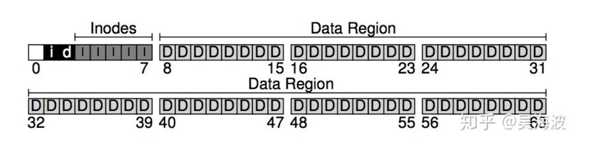
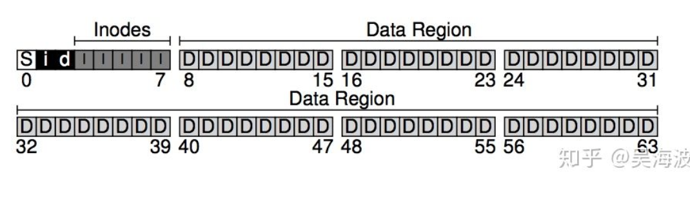
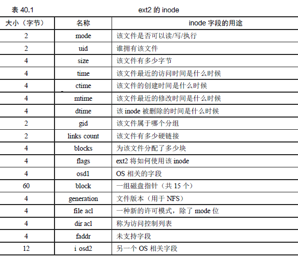

## io发展过程

1. CPU直接控制外围设备(硬盘磁带等), 在简单微处理器中常用
2. 增加I/O模块, 将CPU与外围设备解耦, CPU只与I/O模块打交道. 只需定义好接口, CPU厂商和外围设备厂商就可以相互根据接口开发, 互不影响
3. 增加中断方式, 还是经过I/O模块, 只不过I/O模块完成之后, 只需通知CPU即可, CPU在等待阶段完全可以去做其他事情, 提高CPU利用率.
4. I/O模块增加DMA控制器. 之前的阶段是每次只传输一个字, 就通知CPU, 就发起一次中断, CPU放到寄存器中, 再放到内存中. 这样CPU就会被连续的中断打断, 不断切换进程, 上下文, 效率很低。
DMA控制器类似于一个小的CPU, 有自己的寄存器(记录主存地址和取到的字的count等). CPU可以发起一个DMA请求, 传入读写操作类型, 相关I/O设备地址, 内存的起始地址, 
要操作的字数。然后DMA就可以获取总线的控制权, 将一大块内存和外部I/O读入或写出.等操作完成后, 再通知CPU. 释放总线控制权。


## io数据传输方式

回顾一下IO数据传输的四种方式，循环IO测试、程序中断IO、DMA方式和通道方式。

1. 循环IO测试（Programmed I/O）：计算机的IO测试指令通过轮询的方式，检测IO设备的忙/闲标志，决定主存和外设之间是或否传出一个字或者一个字符。
   在这种情况下，CPU的大量时间在等待输入、输出的循环检测上，使计算机不能充分发挥效率，外设也得不到合理的使用，整个系统效率低下。


2. 程序中断（Interrupt-Driven I/O）：IO设备的控制器逐个比特的从设备中读取一块数据放入设备的内部缓冲区中，然后，计算该块数据的校验和，以保证读取的正确性，接着，设备控制器发出中断信号，操作系统开始逐个字节地从缓冲区中数据读入内存。中断机制的引入，使得外围设备有了反映自身状态的能力，仅当IO操作正常或者异常结束时才中断CPU，从而实现了一定程度的并行。但是，IO操作毕竟是由CPU控制的，此时每传输一个字或字符，往往就要中断一次。中断也需要消耗时间，因此这种模式也在一定程度上浪费了CPU时间。当IO设备很多时，CPU可能完全陷入处理IO中断中。

3. DMA方式：在内存和IO设备之间直接进行数据交换，不需要CPU的干预。当需要IO数据传输时，CPU将DMA初始化，之后DMA接管总线的使用权，将所需要的数据全部读入内存后，IO设备的控制器才会发出中断。本质上讲， DMA也是Programmed I/O，只是DMA controller替代了CPU的工作。
  DMA的好处在于将CPU中断从每个字符中断减少为每个缓冲区中断，从而如果输出字符很多时，能带来可观的性能提升。
  另一方面，DMA controller往往比CPU慢很多，如果DMA controller不能全速驱动输出设备或者当等待DMA时CPU经常无其他任务可做，那么Interrupt-Driven I/O或Programmed I/O可能更好。但是，大多数情况下，DMA都是更好的。

```
对于以上三种方式,都需要CPU介入：
    循环IO测试：完全介入
    程序中断：需要CPU介入，但在数据读入IO设备的缓冲区，发出中断前，CPU可以做其他事务
    DMA：在传输开始（DMA初始化）和传输结束（中断）时介入
都需要硬件接口支持：
    循环IO测试：最简单的硬件
    程序中断：增加中断控制器
    DMA：增加DMA
```


## 基本输入输出

* 打开文件的本质：程序与文件之前建立连接或通信通道，打开文件需要利用相关的系统调用，内核中建立相关的数据结构。两种机制描述程序与文件的连接【程序的角度】
    * 文件描述字：提供更加底层的操作函数，多数为系统调用，三个最基础的文件描述子：标准输入、标准输出、标准错误输出。
    * 流：建立在文件描述字之上，提供更加上层的函数，包含自己的缓冲区。
* 文件位置指针：文件位置指针给出了文件中当前读写字符的位置，它是一个距离文件开始多少字节数的整数，也是每个进程文件的一个属性，一般提供相关的API可以修改文件位置指针。
* 以python为例，打开一个文件流需要注意什么？
    * 文件位置、模式（w、r、a等）、缓冲区大小
    * 其他语言：对错误情形的处理，python会产生异常
* 一般情况下的操作模式：字符I/O函数、行I/O函数、二进制I/O
* 缓冲区的作用：缓冲区的核心作用还是减少调用低级I/O函数的次数，刷新I/O的时机可能是流关闭、结束程序、缓冲区已经满了，如果有必要也可以手动刷新flush()函数来强制刷新用户缓冲区。


* 内核缓冲区：操作系统内核通常会用到一片专门的区域作为I/O函数缓冲区，这一区域可看成I/O数据的快速中转站。内核缓冲区在适当的时候【操作系统决定】将I/O数据写入到磁盘中。因此调用write函数并不意味着数据已经写入到了外部永久的存储介质中，即使是close关闭文件也是如此，用户进程只能控制用户缓冲区控制不了内核缓冲区，这种可能不同步的情况在有些场景下是无法接受的，因此Unix提供了两种手段来解决这个问题：
    * 打开文件的时候设置O_SYNC标志，可以保证每次写数据都直接写入磁盘，每次调用write知道数据安全落盘才能返回
    * 调用fsync或者fdatasync方法，这两个方法强制将描述子相关文件所有修改过的数据传送到永久的介质，每次调用阻塞直到安全落盘【更推荐的方式
    
* 临时文件：os.tmpfile() 方法用于返回一个打开的模式为(w+b)的临时文件对象，这文件对象没有文件夹入口，没有文件描述符，将会自动删除。
* 重定向函数：dup与dup2，当调用dup函数时，内核在进程中创建一个新的文件描述符，此描述符是当前可用文件描述符的最小数值，这个文件描述符指向oldfd所拥有的文件表项。

## 打开文件的背后

* 进程文件打开表：每个活跃的进程在系统的进程表中有一个登记项PCB、进程表项有一个进程打开文件表，这个表可以看成一个数组，每个元素对于一个文件描述符FD，每次打开一个文件在数组中指定一个元素并返回该数组元素的索引【每次返回当前最小的未使用的描述字】，该数组元素记录着文件描述字的如下信息：文件描述符标签、指向系统打开文件表项的指针
* 系统文件打开表：每次open调用成功后，系统文件打开表会建立一个打开文件表项，一个表项代表着一个已经打开的文件，它含有已经打开文件的如下信息，文件状态标签：O_RDONLY、O_CREAT，当前文件位置以及执行该文件的vode的指针【不同文件打开同一文件需要两个文件打开表项，最终指向同一个vnode】
* vnode结构：vnode是内核中表示文件的数据结构，内核通过与文件相连的vnode访问文件,vonde包含文件有过的所有维护信息【属主、文件大小、设备信息】以及inode信息。



## 文件状态标签

打开文件的时候需要指定相关的文件标签，有以下几种类型的标志

* 访问方式标志：指明允许文件标志符用于读、写或两者兼之，包括O_RDONLY、O_WRONLY和O_RDWR。
* 打开时标志：指明打开文件时影响open行为的一些选项。O_CREAT：若设置，当该文件不存在时创建并打开此文件。
* I/O操作方式标志：使用fd读/写的工作方式。这些标志由open()设置，之后可以用fcntl()获取和改变。O_APPEND：用于追加写，O_NONBLOCK：用于非阻塞I/O，O_SYNC：用于同步I/O，O_DSYNC：用于同步数据I/O，简单地说，O_SYNC、O_DSYNC和O_RSYNC这几个标志的主要作用是使数据直接写到磁盘或直接从磁盘读入。


## 文件系统

* 如何实现简单的文件系统：磁盘上的哪些结构存储文件系统的数据和元数据？当一个进程打开一个文件时会发生什么？在读取或写入期间访问哪些磁盘结构？

* 基本组成：数据区域与inode区域，文件系统必须跟踪每个文件的信息。该信息是元数据的关键部分，元数据会记录文件由哪些块构成，文件的大小，文件的所有者或者权限，修改时间等等。为了存储这些信息，文件系统通常有一个名为inode的结构（我们将在下面详细介绍inode）。为了容纳inode，我们还需要在磁盘上为它们预留一些空间。让我们将磁盘的这一部分称为inode table，它是保存在磁盘上的inode数组。inode通常不那么大，例如128或256字节。假设每个inode 是256个字节，一个4KB的块可以容纳16个inode。



* 增加位图：需要记录inode区域和data区域哪些是空闲哪些是已经分配了的。因此，这种allocation structures是任何文件系统中的必需元素。当然，许多种跟踪分配方法都是可能的。我们选择一种简单而流行的结构，称为位图，一种用于数据区域（数据位图），另一种用于inode表（inode位图）。位图是一种简单的结构：每个位用于指示相应的对象/块是空闲0还是正在使用1，新的磁盘布局，带有inode位图i和数据位图d。



* 超级块：文件系统的磁盘结构的设计中还剩下一个块。这是为超级块保留的，在下图中用S表示。超级块包含有关此特定文件系统的信息，例如，文件系统中有多少inode和数据块（在本例中分别为80和56），inode表开始块（块3），依此类推。它可能还包括一些神奇的数字来识别文件系统类型（在本例中为vsfs）。因此，在安装文件系统时，操作系统将首先读取超级块，初始化各种参数，然后将卷附加到文件系统树。当访问卷中的文件时，系统将可以确切地知道在哪里寻找所需的磁盘上的结构。

```
备注：inode和数据块的数量是固定的而不是动态的，超级快包含了文件系统的元信息以及inode表的开始位置,利用inode号可以定位到相关的信息。
```



## inode

* inode是文件系统最重要的磁盘结构之一;几乎所有文件系统都具有与此类似的结构。名称inode是index node的缩写。每个inode都由一个数字（称为i-number）隐式引用，我们之前称之为文件的低级名称。在vsfs（和其他简单文件系统）中，给定一个i-number，应该能够直接计算磁盘上相应inode所在的位置即inode块。


* 在每个inode 中，实际上是所有关于文件的信息：文件类型（例如，常规文件、目录等）、大小、分配给它的块数、保护信息（如谁拥有该文件以及谁可以访问它）、一些时间信息（包括文件创建、修改或上次访问的时间文件下），以及有关其数据块驻留在磁盘上的位置的信息（如某种类型的指针）。我们将所有关于文件的信息称为元数据（metadata）。



* 引用物理块：在inode 中有一个或多个直接指针（磁盘地址）。每个指针指向属于该文件的一个磁盘块。有一个称为间接指针（indirect pointer）的特殊指针。它不是指向包含用户数据的块，而是指向包含更多指针的块，每个指针指向用户数据。因此，inode 可以有一些固定数量（例如 12 个）的直接指针和一个间接指针。


* 文件缓存：读取和写入文件可能是昂贵的，会导致（慢速）磁盘的许多I/O。这显然是一个巨大的性能问题，为了弥补，大多数文件系统积极使用系统内存（DRAM）来缓存重要的块。现代系统采用动态划分（dynamic partitioning）方法。具体来说，许多现代操作系统将虚拟内存页面和文件系统页面集成到统一页面缓存中（unified page cache）。大多数现代文件系统将写入在内存中缓冲5～30s，这代表了另一种折中：如果系统在更新传递到磁盘之前崩溃，更新就会丢失。但是，将内存写入时间延长，则可以通过批处理、调度甚至避免写入，提高性能。