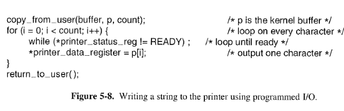

## io发展过程

1. CPU直接控制外围设备(硬盘磁带等), 在简单微处理器中常用
2. 增加I/O模块, 将CPU与外围设备解耦, CPU只与I/O模块打交道. 只需定义好接口, CPU厂商和外围设备厂商就可以相互根据接口开发, 互不影响
3. 增加中断方式, 还是经过I/O模块, 只不过I/O模块完成之后, 只需通知CPU即可, CPU在等待阶段完全可以去做其他事情, 提高CPU利用率.
4. I/O模块增加DMA控制器. 之前的阶段是每次只传输一个字, 就通知CPU, 就发起一次中断, CPU放到寄存器中, 再放到内存中. 这样CPU就会被连续的中断打断, 不断切换进程, 上下文, 效率很低。
DMA控制器类似于一个小的CPU, 有自己的寄存器(记录主存地址和取到的字的count等). CPU可以发起一个DMA请求, 传入读写操作类型, 相关I/O设备地址, 内存的起始地址, 
要操作的字数。然后DMA就可以获取总线的控制权, 将一大块内存和外部I/O读入或写出.等操作完成后, 再通知CPU. 释放总线控制权。


## io数据传输方式

回顾一下IO数据传输的四种方式，循环IO测试、程序中断IO、DMA方式和通道方式。

1. 循环IO测试（Programmed I/O）：计算机的IO测试指令通过轮询的方式，检测IO设备的忙/闲标志，决定主存和外设之间是或否传出一个字或者一个字符。
   在这种情况下，CPU的大量时间在等待输入、输出的循环检测上，使计算机不能充分发挥效率，外设也得不到合理的使用，整个系统效率低下。



2. 程序中断（Interrupt-Driven I/O）：IO设备的控制器逐个比特的从设备中读取一块数据放入设备的内部缓冲区中，然后，计算该块数据的校验和，以保证读取的正确性，接着，设备控制器发出中断信号，操作系统开始逐个字节地从缓冲区中数据读入内存。
中断机制的引入，使得外围设备有了反映自身状态的能力，仅当IO操作正常或者异常结束时才中断CPU，从而实现了一定程度的并行。
但是，IO操作毕竟是由CPU控制的，此时每传输一个字或字符，往往就要中断一次。中断也需要消耗时间，因此这种模式也在一定程度上浪费了CPU时间。当IO设备很多时，CPU可能完全陷入处理IO中断中。

3. DMA方式：在内存和IO设备之间直接进行数据交换，不需要CPU的干预。当需要IO数据传输时，CPU将DMA初始化，之后DMA接管总线的使用权，将所需要的数据全部读入内存后，IO设备的控制器才会发出中断。
  本质上讲， DMA也是Programmed I/O，只是DMA controller替代了CPU的工作。
  DMA的好处在于将CPU中断从每个字符中断减少为每个缓冲区中断，从而如果输出字符很多时，能带来可观的性能提升。
  另一方面，DMA controller往往比CPU慢很多，如果DMA controller不能全速驱动输出设备或者当等待DMA时CPU经常无其他任务可做，那么Interrupt-Driven I/O或Programmed I/O可能更好。但是，大多数情况下，DMA都是更好的。

```
对于以上三种方式,都需要CPU介入：
    循环IO测试：完全介入
    程序中断：需要CPU介入，但在数据读入IO设备的缓冲区，发出中断前，CPU可以做其他事务
    DMA：在传输开始（DMA初始化）和传输结束（中断）时介入
都需要硬件接口支持：
    循环IO测试：最简单的硬件
    程序中断：增加中断控制器
    DMA：增加DMA
```
