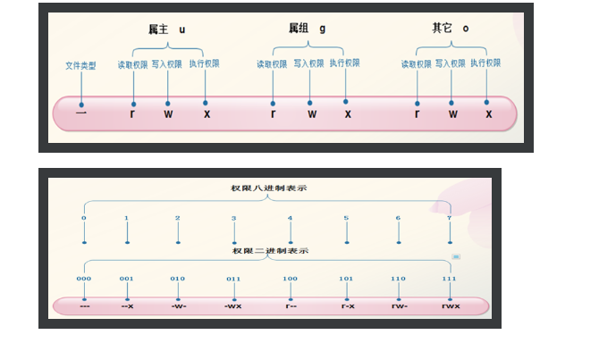

## 文件的本质

* 文件本质是存放数据的容器，物理上文件存储在磁盘中由一系列的数据快组成。在linux中，每一个存放在磁盘上的文件由以下两部分构成：数据块，inode【用于描述文件特征的数据结构】，inode：储存文件的“元信息”，比如文件的创建者、文件的创建日期、文件的大小等等。这种储存文件元信息的区域就叫做inode，中文译名为"索引节点"，每个文件由自己的inode号，这个是唯一的。

    ```
    文件的字节数
    文件拥有者的User ID
    文件的Group ID
    文件的读、写、执行权限
    文件的时间戳，共有三个：ctime指inode上一次变动的时间，mtime指文件内容上一次变动的时间，atime指文件上一次打开的时间。
    链接数，即有多少文件名指向这个inode
    文件数据block的位置
    ```
    
    ```
    stat查看inode信息、file查看文件类型
    ```
    
## 文件类型   

* 普通文件：由一系列的字节组成

* 目录文件：目录是由目录登记项组成的一张表，目录中的每个文件和子目录都在其中有一个登记项，每个登记项用来映射文件名到inode，
  命令ls -ai 可以列出当前目录的内容，名为.和..的项目是当前目录和其父目录【目录文件用户不能写，进程只要有读权限就可以读目录内容，只有操作系统内核才能写目录文件】
  
* 链接文件：unix文件系统提供了一个使多文件名表示一个文件的机制，这就是链接也称硬链接，这个有点像快捷方式，通过在目录中建立一个新的登记项来实现这种链接，登记项具有一个新的文件名和要链接文件的inode，
这个登记项也可以成为文件的链接，一个普通文件可以有多个链接，但是inode只有一个，增加的只是登记项而已，只要文件的链接数不为0，该文件就存在。给文件建立一个链接可以使用link函数来完成，删除使用unlink。局限：只能由超级用户操作、没有inode信息。


* 符号链接文件：指向另一个文件的特殊文件，符号链接有自己的inode，符号链接在磁盘上存放的内容是另一个文件的路径名，可以是绝对路径也可以是相对路径，使用symlink和readlink函数来操作。ln -s用于创建符合链接也称之为软链接。


* 特别文件：也称之为设备文件，特别文件不包含数据，他们的作用是将物理设备映射到文件系统的文件名。Unix中，每一种设备都至少与一个特别文件相连。
特别文件可以通过mknod系统调用创建，并且与内核的一个软件相连，软件也称之为设备驱动程序。应用程序可以打开、关闭和读写这些设备文件，完成对设备的操作，就像操作普通的数据文件一样。当程序要对设备文件读取或者写入的时候，这会导致与之相连的设备动作，设备驱动程序会在用户进程之间传递数据。

* 块设备文件：与块设备相互连接，所谓快设备包含硬盘、软盘，传递的数据是512字节或者2的幂次方【可随机访问】，利用块设备传输数据可以在系统内部的缓冲区内缓存数据。

* 字符设备文件：与字符设备相互连接，可以传送任意大小的数据，也可以一个字节一个字节的传送，每次产生一个中断【不能随机访问】，字符设备直接在设备驱动程序和用户进程之间传送数据，不经过系统的缓冲区，像串口和键盘就都属于字符设备。

* 区分块设备和字符设备：ls -l 查看文件列表，以字母b和c开头的分别是块特别文件和字符特别文件。


## 文件的属主与权限

* 每个用户有用户名和用户ID并且有自己的组和组ID，同样UNIX中的文件也都有一个属主和属主所在的组，属主就是创建文件的用户。其中，文件的属主id和组id都遗传于创建他们的进程。

* 文件的访问权限：文件权限相关有三组：属主、属组、其他



* 目录的访问权限解释：
     * 读权限：允许看目录内有哪些文件。
     * 写权限：允许修改目录的内容，可以重命名、删除文件、创建文件。
     * 执行权限：具有进入目录的权限，用路径名打开文件时，必须要有每一个目录的执行权限

* 相关命令   
    ```
    chmod 修改文件权限、chown修改文件属主和属组
    ```
* 文件相关时间

每一个文件都有三个时间戳：最近访问时间、最近修改时间、最近特征修改时间【这里指inode】，当修改inode相关的信息的时候后者都会变化。利用文件的访问时间可以查出长期没有被访问的文件，修改时间可以提供我们一些参考信息，帮助我们对文件进行归档。利用ls命令默认情况下只列出了最近修改时间，-u给出访问时间，-c给出特征修改时间。