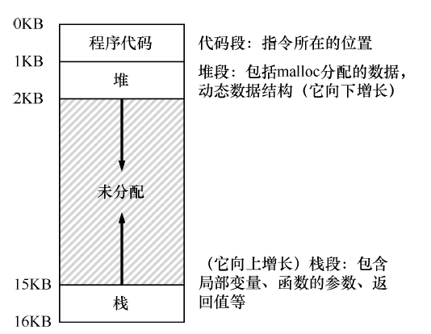
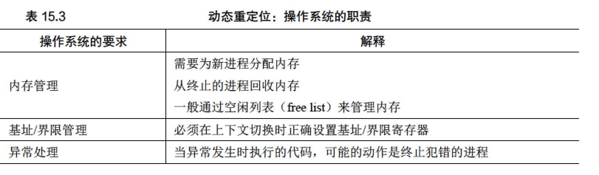
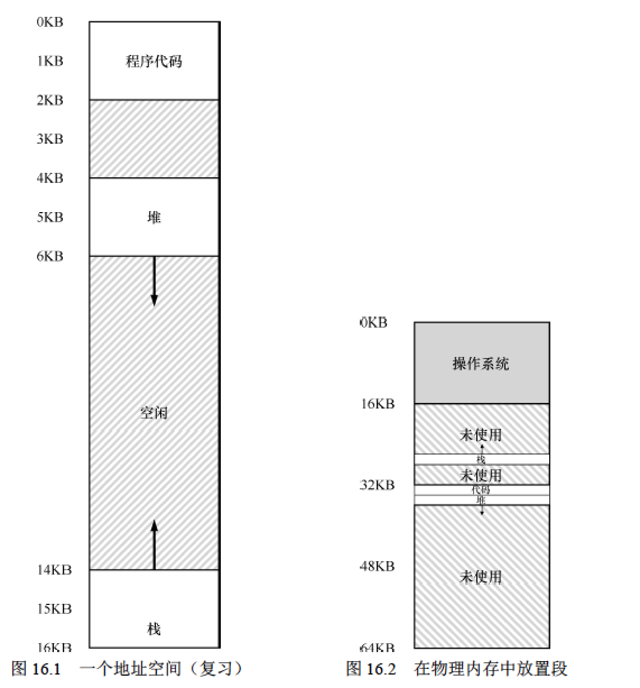
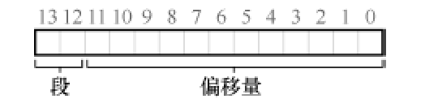
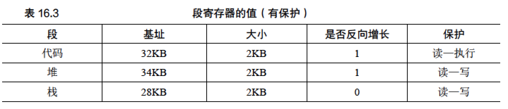
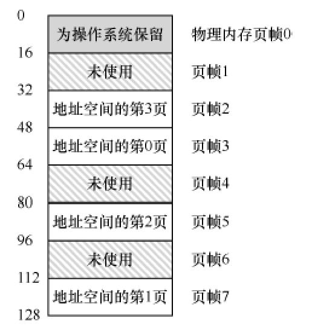

##  地址空间
* 多道程序：多个进程通过时分共享技术共享CPU，每个进程有自己的上下文，发生上下文
切换时将进程信息放在内存中。

* 地址空间：操作系统需要提供物理内存的抽象，这个称之为地址空间，进程的地址空间包含运行的程序的所有内存状态。



每个进程的地址空间应当是私有的、巨大的，这样才能保证程序的正常运行，但是物理内存又是有限的，
因此如何在单一的物理内存上为多个进程都提供地址空间的抽象是很难的，这也是操作系统要做的工作。

* 要做的工作与目标：虚拟化内存，具体目标如下：
    * 透明性： 程序不应感知到内存被虚拟化的事实，好像他拥有的就是物理内存。
    * 效率：   时间上很快，空间上占用很小，需要硬件的支持。
    * 隔离和保护： 提供进程之间的隔离，一个进程不应当影响另一个进程
    
*  虚拟内存：上面提到的地址空间就是虚拟内存，操作系统借助硬件的支持下，提供从虚拟内存到物理内存的转换。

## 地址转换

利用地址转换，硬件对每次内存访问进行处理（即指令获取、数据读取或写入），将指令中的虚拟（virtual）地址转换为数据实际存储的物理（physical）地址。

* 动态重定位：在20 世纪50年代后期，它在首次出现的时分机器中引入，那时只是一个简单的思想，称为基址加界限
机制（base and bound），有时又称为动态重定位（dynamic relocation），具体来说，每个CPU 需要两个硬件寄存器：基址（base）寄存器和界限（bound）寄存器，有时称为限制（limit）寄存器。这组基址和界限寄存器，让我们能够将地址空间放在物理内存的任何位置，同时又能确保进程只能访问自己的地址空间。如果进程需要访问超过这个界限或者为负数的虚拟地址，CPU 将触发异常，进程最终可能被终止。界限寄存器的用处在于，它确保了进程产生的所有地址都在进程的地址界限中。
```
physical address = virtual address + base
```



* 内部碎片：但由于该进程的栈区和堆区并不很大，导致这块内存区域中大量的空间被浪费。这种浪费通常称为内部碎片（internal fragmentation），指的是已经分配的内存单元内部有未使用的空间（即碎片），造成了浪费。


## 分段

* 问题由来：如果我们将整个地址空间放入物理内存，那么栈和堆之间的空间并没有被进程使用，却依然占用了实际的物理内存。因此，简单的通过基址寄存器和界限寄存器实现的虚拟内存很浪费，分段能更好地支持稀疏地址空间。

* 泛化的基址/界限：划分多个逻辑段，在典型的地址空间里有 3 个逻辑不同的段：代码、栈和堆。分段的机制使得操作系统能够将不同的段放到不同的物理内存区域，从而避免了虚拟地址空间中的未使用部分占用物理内存。



* 虚拟地址结构如下：



* 支持共享与定义增长方向：增加一些段的元信息，为了支持共享，需要一些额外的硬件支持，这就是保护位（protection bit）。基本为每个段增加了几个位，标识程序是否能够读写该段，或执行其中的代码。通过将代码段标记为只读，同样的代码可以被多个进程共享，而不用担心破坏隔离。虽然每个进程都认为自己独占这块内存，但操作系统秘密地共享了内存，进程不能修改这些内存，所以假象得以保持。



```
    上下文切换需要保存和恢复各个段寄存器的值
    外部碎片：物理内存很快充满了许多空闲空间的小洞，因而很难分配给新的段，或扩大已有的段，这种问题被称为外部碎片。
            该问题的一种解决方案是紧凑（compact）物理内存，重新安排原有的段。例如，操作系统先终止运行的进程，
            将它们的数据复制到连续的内存区域中去，改变它们的段寄存器中的值，指向新的物理地址，从而得到了足够大的连续空闲空间。
```


* 问题：分段还是不足以支持更一般化的稀疏地址空间。例如，如果有一个很大但是稀疏的堆，都在一个逻辑段中，整个堆仍然必须完整地加载到内存中，这个问题通过页式内存分配来解决。


## 分页

* 概念：分页不是将一个进程的地址空间分割成几个不同长度的逻辑段（即代码、堆、段），而是分割成固定大小的单元，每个单元称为一页。相应地，我们把物理内存看成是定长槽块的阵列，叫作页帧（page frame）。

* 页表：为了记录地址空间的每个虚拟页放在物理内存中的位置，操作系统通常为每个进程保存一个数据结构，称为页表（page table）。页表的主要作用是为地址空间的每个虚拟页面保存地址转换（address translation），从而让我们知道每个页在物理内存中的位置，这个页表是一个每进程的数据结构。



* 地址空间：虚拟页面号（virtual page number，VPN）和页内的偏移量（offset）。页表存放可以存放在内存中，当内存紧张的时候可以置换到硬盘上面，页表还是挺大的，一个20 位的VPN 意味着，操作系统必须为每个进程管理很多很多个地址转换（大约一百万）。假设每个页表格条目（PTE）需要4个字节，来保存物理地址转换和任何其他有用的东西，每个页表就需要巨大的4MB 内存！