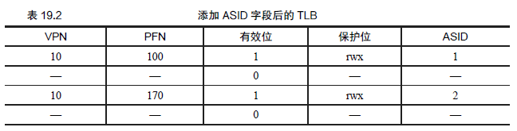
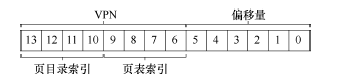

## 快速地址转换TLB

* 问题由来：分页逻辑上需要一次额外的内存访问。每次指令获取、显式加载或保存，都要额外读一次内存以得到转换信息。

* 地址转换缓冲：地址转换旁路缓冲存储器（translation-lookasidebuffer，TLB[CG68,C95]），
它就是频繁发生的虚拟到物理地址转换的硬件缓存（cache）。因此，更好的名称应该是地址转换缓存（address-translation cache）。
对每次内存访问，硬件先检查TLB，看看其中是否有期望的转换映射,虚拟页号到页表项的映射。
```
VPN = (VirtualAddress & VPN_MASK) >> SHIFT
(Success, TlbEntry) = TLB_Lookup(VPN)
if (Success == True) // TLB Hit
    if (CanAccess(TlbEntry.ProtectBits) == True)
        Offset = VirtualAddress & OFFSET_MASK
        PhysAddr = (TlbEntry.PFN << SHIFT) | Offset
        AccessMemory(PhysAddr)
    else
        RaiseException(PROTECTION_FAULT)
else // TLB Miss
    PTEAddr = PTBR + (VPN * sizeof(PTE))
    PTE = AccessMemory(PTEAddr)
    if (PTE.Valid == False)
        RaiseException(SEGMENTATION_FAULT)
    else if (CanAccess(PTE.ProtectBits) == False)
        RaiseException(PROTECTION_FAULT)
    else
        TLB_Insert(VPN, PTE.PFN, PTE.ProtectBits)
        RetryInstruction()
TLB 处理器核心附近，设计的访问速度很快。如果TLB未命中，就会带来很大的分页开销。必须访问页表来查找转换映射，
导致一次额外的内存引用。
```     

* TLB的内容：一条TLB 项内容可能像下这样：VPN ｜ PFN ｜ 其他位。
``` 
TLB 的有效位!=页表的有效位
    如果一个页表项（PTE）被标记为无效，就意味着该页并没有被进程申请使用，正常运行的程序不应该访问该地址。
    TLB 的有效位不同，只是指出TLB 项是不是有效的地址映射，没有地址转换映射被缓存在这里。
``` 

* 上下文切换时对TLB 的处理：
    * 方案1：在上下文切换时，简单地清空（flush）TLB，这样在新进程运行前TLB 就变成了空的。但是，有一定开销：每次进程运行，当它访问数据和代码页时，都会触发TLB未命
中。如果操作系统频繁地切换进程，这种开销会很高。

    * 方案2：系统增加了硬件支持，实现跨上下文切换的TLB 共享。比如有的系统在TLB 中添加了一个地址空间标识符（Address Space Identifier，ASID），实现了跨进程的TLB共享。



## 分页进阶

* 如何让页表更小：地址空间大，页表就很大，因此消耗的内存太多。
 
方法1：使用更大的页，再以32 位地址空间为例，但这次假设用16KB的页，之前使用的是4KB的页。大内存页会导致每页内的浪费，这被称为内部碎片（internal
fragmentation）问题（因为浪费在分配单元内部）。

方法2：混合分页和分段：不是为进程的整个地址空间提供单个页表，而是为每个逻辑分段提供一个。
分段中，有一个基址（base）寄存器，告诉我们每个段在物理内存中的位置，还有一个界限（bound）或限制（limit）寄存器，告诉我们该段的大小。在杂合方案中，
我们仍然在MMU 中拥有这些结构。在这里，我们使用基址不是指向段本身，而是保存该段的页表的物理地址。界限寄存器用于指示页表的结尾（即它有多少有效页）。
相比分页方案，这个方案是每个页一个寄存器，使得每个页的页表大小可以不同。

``` 
SN = (VirtualAddress & SEG_MASK) >> SN_SHIFT
VPN = (VirtualAddress & VPN_MASK) >> VPN_SHIFT
AddressOfPTE = Base[SN] + (VPN * sizeof(PTE))
``` 
     
 方案3：多级页表，多级页表的基本思想很简单。首先，将页表分成页大小的单元。然后，如果整页的页
表项（PTE）无效，就完全不分配该页的页表，使用了名为页目录（page directory）的新结构。页目录因此可以告诉
你页表的页在哪里，或者页表的整个页不包含有效页。先找利用页目录定位页表，再通过页表定位PFN。


* 页表交换到磁盘：即使我们有很多技巧来减小页表的大小，但是它仍然有可能是太大而无法一
次装入内存。因此，一些系统将这样的页表放入内核虚拟内存（kernel virtual memory），从
而允许系统在内存压力较大时，将这些页表中的一部分交换（swap）到磁盘。
    


        