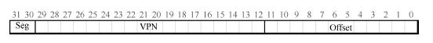

## 快速地址转换TLB

* 问题由来：分页逻辑上需要一次额外的内存访问。每次指令获取、显式加载或保存，都要额外读一次内存以得到转换信息。

* 地址转换缓冲：地址转换旁路缓冲存储器（translation-lookasidebuffer，TLB[CG68,C95]），
它就是频繁发生的虚拟到物理地址转换的硬件缓存（cache）。因此，更好的名称应该是地址转换缓存（address-translation cache）。
对每次内存访问，硬件先检查TLB，看看其中是否有期望的转换映射,虚拟页号到页表项的映射。
```
VPN = (VirtualAddress & VPN_MASK) >> SHIFT
(Success, TlbEntry) = TLB_Lookup(VPN)
if (Success == True) // TLB Hit
    if (CanAccess(TlbEntry.ProtectBits) == True)
        Offset = VirtualAddress & OFFSET_MASK
        PhysAddr = (TlbEntry.PFN << SHIFT) | Offset
        AccessMemory(PhysAddr)
    else
        RaiseException(PROTECTION_FAULT)
else // TLB Miss
    PTEAddr = PTBR + (VPN * sizeof(PTE))
    PTE = AccessMemory(PTEAddr)
    if (PTE.Valid == False)
        RaiseException(SEGMENTATION_FAULT)
    else if (CanAccess(PTE.ProtectBits) == False)
        RaiseException(PROTECTION_FAULT)
    else
        TLB_Insert(VPN, PTE.PFN, PTE.ProtectBits)
        RetryInstruction()
TLB 处理器核心附近，设计的访问速度很快。如果TLB未命中，就会带来很大的分页开销。必须访问页表来查找转换映射，
导致一次额外的内存引用。
```     

* TLB的内容：一条TLB 项内容可能像下这样：VPN ｜ PFN ｜ 其他位。
``` 
TLB 的有效位!=页表的有效位
    如果一个页表项（PTE）被标记为无效，就意味着该页并没有被进程申请使用，正常运行的程序不应该访问该地址。
    TLB 的有效位不同，只是指出TLB 项是不是有效的地址映射，没有地址转换映射被缓存在这里。
``` 

* 上下文切换时对TLB 的处理：
    * 方案1：在上下文切换时，简单地清空（flush）TLB，这样在新进程运行前TLB 就变成了空的。但是，有一定开销：每次进程运行，当它访问数据和代码页时，都会触发TLB未命
中。如果操作系统频繁地切换进程，这种开销会很高。

    * 方案2：系统增加了硬件支持，实现跨上下文切换的TLB 共享。比如有的系统在TLB 中添加了一个地址空间标识符（Address Space Identifier，ASID），实现了跨进程的TLB共享。


## 分页进阶

* 如何让页表更小：地址空间大，页表就很大，因此消耗的内存太多。
 
方法1：使用更大的页，再以32 位地址空间为例，但这次假设用16KB的页，之前使用的是4KB的页。大内存页会导致每页内的浪费，这被称为内部碎片（internal
fragmentation）问题（因为浪费在分配单元内部）。

方法2：混合分页和分段：不是为进程的整个地址空间提供单个页表，而是为每个逻辑分段提供一个。
分段中，有一个基址（base）寄存器，告诉我们每个段在物理内存中的位置，还有一个界限（bound）或限制（limit）寄存器，告诉我们该段的大小。在杂合方案中，
我们仍然在MMU 中拥有这些结构。在这里，我们使用基址不是指向段本身，而是保存该段的页表的物理地址。界限寄存器用于指示页表的结尾（即它有多少有效页）。
相比分页方案，这个方案是每个页一个寄存器，使得每个页的页表大小可以不同。

``` 
SN = (VirtualAddress & SEG_MASK) >> SN_SHIFT
VPN = (VirtualAddress & VPN_MASK) >> VPN_SHIFT
AddressOfPTE = Base[SN] + (VPN * sizeof(PTE))
``` 
     
 方案3：多级页表，多级页表的基本思想很简单。首先，将页表分成页大小的单元。然后，如果整页的页
表项（PTE）无效，就完全不分配该页的页表，使用了名为页目录（page directory）的新结构。页目录因此可以告诉
你页表的页在哪里，或者页表的整个页不包含有效页。先找利用页目录定位页表，再通过页表定位PFN。


* 页表交换到磁盘：即使我们有很多技巧来减小页表的大小，但是它仍然有可能是太大而无法一
次装入内存。因此，一些系统将这样的页表放入内核虚拟内存（kernel virtual memory），从
而允许系统在内存压力较大时，将这些页表中的一部分交换（swap）到磁盘。

## 交换空间

操作系统需要提供比内存更大的地址空间，因此需要借助硬盘，需要吧当前没有用的那部分地址空间
找个地方存储起来，这个就是硬盘或者SSD。

* 概念：硬盘上开辟一部分空间用于物理页的移入和移出，一般这样的空间称为交换空间（swap space），因为我们将内存中的页交换到
其中，并在需要的时候又交换回去。操作系统以页为单位来读取或者写入交换空间。

* 回顾：硬件首先从虚拟地址获得VPN，检查TLB 是否匹配（TLB 命中），如果命中，则获得最
终的物理地址并从内存中取回。这希望是常见情形，因为它很快（不需要额外的内存访问）。如果在TLB 中找不到VPN（即TLB 未命中），则硬件在内存中查找页表（使用页表基
址寄存器），并使用VPN 查找该页的页表项（PTE）作为索引。如果页有效且存在于物理内
存中，则硬件从PTE 中获得PFN，将其插入TLB，并重试该指令，这次产生TLB 命中。

* 存在位：具体来说，当硬件在PTE中查找时，可能发现页不在物理内存中。
硬件（或操作系统，在软件管理TLB 时）判断是否在内存中的方法，是通过页表项中的一条新信息，即存在位（present bit）。如果存在位设
置为1，则表示该页存在于物理内存中，并且所有内容都如上所述进行。如果存在位设置为
零，则页不在内存中，而在硬盘上。访问不在物理内存中的页，这种行为通常被称为页错
误（page fault）。

* 页错误：如果页不存在，都由操作系统负责处理页错误。操作系统的页错误处理程序
（page-fault handler）确定要做什么。操作系统可以用PTE 中的某些位来存储硬盘地址，
这些位通常用来存储像页的PFN 这样的数据。当操作系统接收到页错误时，它会在PTE 中
查找地址，并将请求发送到硬盘，将页读取到内存中。当硬盘I/O 完成时，操作系统会更新页表，将此页标记为存在，更新页表项（PTE）的
PFN 字段以记录新获取页的内存位置，并重试指令。

* 内存满了：内存可能已满（或接近满了）。因此，操作系统可能希望先交换出（page out）一个或多个页，以便为操作系统即将交换入的新页留出空
间。选择哪些页被交换出或被替换（replace）的过程，被称为页交换策略（page-replacement
policy）。

* 现实情况：大多数操作系统会设置高水位线（High Watermark，HW）和低水位线（Low Watermark，LW），来帮助决定何时从内存中清除页。原理是这样：当操
作系统发现有少于LW 个页可用时，后台负责释放内存的线程会开始运行，直到有HW 个
可用的物理页。这个后台线程有时称为交换守护进程（swap daemon）或页守护进程（page
daemon）①，它然后会很开心地进入休眠状态，因为它毕竟为操作系统释放了一些内存。


        