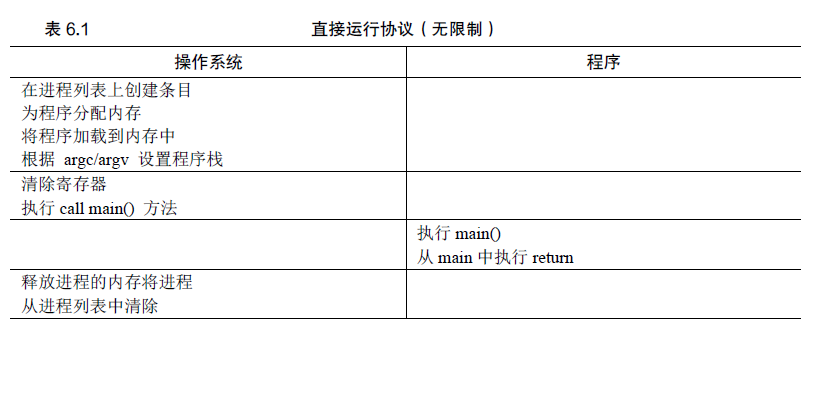
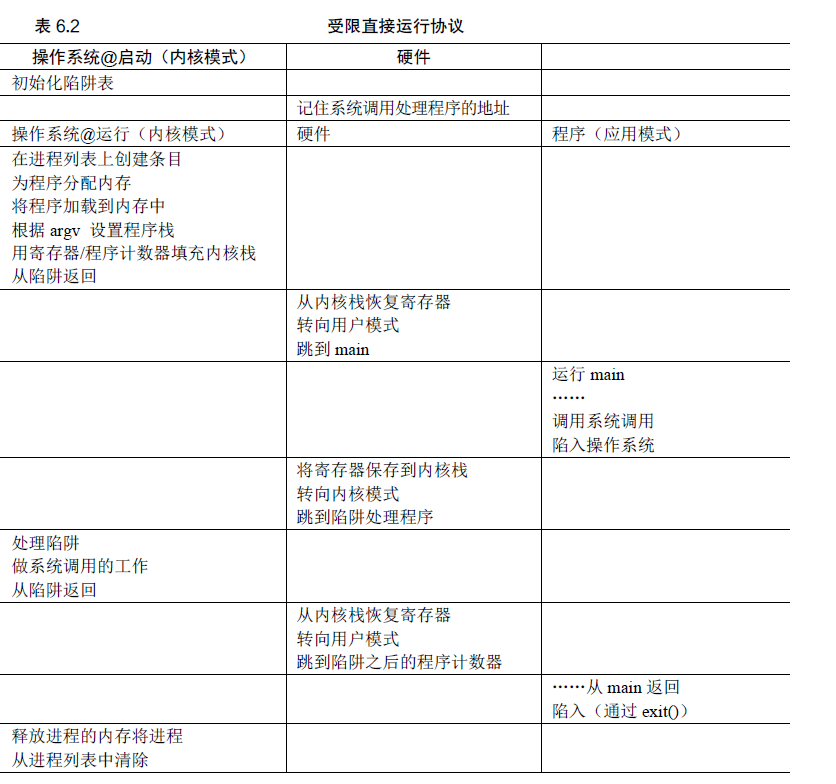

## 受限执行

操作系统利用时分共享技术来完成CPU的虚拟化，但是CPU是一种重要的资源，必须由操作系统来管理不能由进程直接管理，直接
直接使用可能不受控制的一直持有这个资源。直接执行固然快速，但是可能导致不受控的后果。



* 受限制的操作：如果进程希望执行某种受限操作，例如向磁盘发出I/O请求，这些资源是共享资源由操作系统来管理，不能由
进程直接获得，这时候进程从用户模式【受限制】切换到内核模式【特权模式】，由操作系统接管来分配资源。
```
要执行系统调用，程序必须执行特殊的陷阱（trap）指令。该指令同时跳入内核并将特
权级别提升到内核模式。一旦进入内核，系统就可以执行任何需要的特权操作（如果允许），
从而为调用进程执行所需的工作。完成后，操作系统调用一个特殊的从陷阱返回
（return-from-trap）指令，如你期望的那样，该指令返回到发起调用的用户程序中，同时将
特权级别降低，回到用户模式。
```

* 内核模式的状态保存：处理器会将程序计数器、标志和其他一些寄存器推送到每个进程的内核栈（kernel stack）上。从返回陷阱将从栈弹出这
些值，并恢复执行用户模式程序。



第一个阶段（在系统引导时），内核初始化陷阱表，并且CPU 记住它的位置以供随后使用。内核通过特权指令来执行此操作（所有特权指令均以粗体突出显示）。第
二个阶段（运行进程时），在使用从陷阱返回指令开始执行进程之前，内核设置了一些内容。当进程希望发出系统调用时，它会重新陷入操作系统，然后再次通过从陷阱返回，将控制权还给进程。

## 切换进程