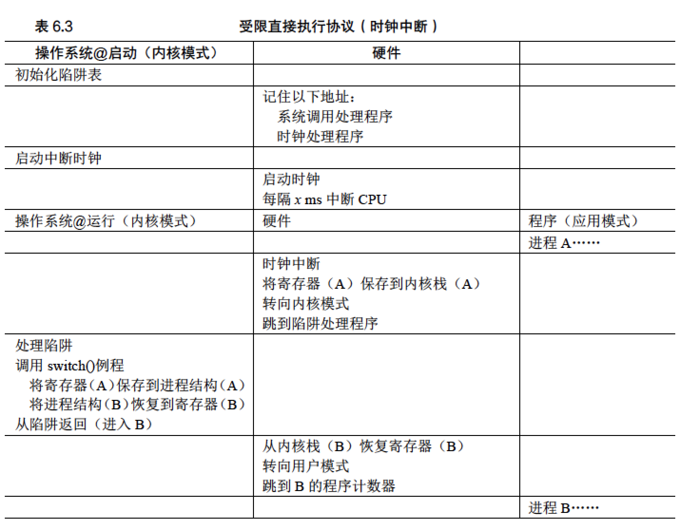

## 受限执行

操作系统利用时分共享技术来完成CPU的虚拟化，但是CPU是一种重要的资源，必须由操作系统来管理不能由进程直接管理，直接
直接使用可能不受控制的一直持有这个资源。直接执行固然快速，但是可能导致不受控的后果。


* 受限制的操作：如果进程希望执行某种受限操作，例如向磁盘发出I/O请求，这些资源是共享资源由操作系统来管理，不能由
进程直接获得，这时候进程从用户模式【受限制】切换到内核模式【特权模式】，由操作系统接管来分配资源。
```
要执行系统调用，程序必须执行特殊的陷阱（trap）指令。该指令同时跳入内核并将特
权级别提升到内核模式。一旦进入内核，系统就可以执行任何需要的特权操作（如果允许），
从而为调用进程执行所需的工作。完成后，操作系统调用一个特殊的从陷阱返回
（return-from-trap）指令，如你期望的那样，该指令返回到发起调用的用户程序中，同时将
特权级别降低，回到用户模式。
```

* 内核模式的状态保存：处理器会将程序计数器、标志和其他一些寄存器推送到每个进程的内核栈（kernel stack）上。从返回陷阱将从栈弹出这些值，并恢复执行用户模式程序。


第一个阶段（在系统引导时），内核初始化陷阱表，并且CPU 记住它的位置以供随后使用。内核通过特权指令来执行此操作（所有特权指令均以粗体突出显示）。第二个阶段（运行进程时），在使用从陷阱返回指令开始执行进程之前，内核设置了一些内容。当进程希望发出系统调用时，它会重新陷入操作系统，然后再次通过从陷阱返回，将控制权还给进程。

## 切换进程

* 时钟中断：操作系统需要重新接管CPU的控制权（regain control），以便可以在进程之间切换。利用时钟中断，产生中断时，当前正在运行的进程停止，操作系统中预先配置的中断处理程序（interrupt handler）会运行。此时，操作系统重新获得CPU 的控制权，因此可以做它想做的事，停止当前进程，并启动另一个进程。操作系统必须通知硬件哪些代码在发生时钟中断时运行。
    ```
    请注意，硬件在发生中断时有一定的责任，尤其是在中断发生时，要为正在运行的程序保存足够的状态，
    以便随后从陷阱返回指令能够正确恢复正在运行的程序。这一组操作与硬件在显式系统调用陷入内核时的行为非常相似，
    其中各种寄存器因此被保存（进入内核栈），因此从陷阱返回指令可以容易地恢复。
    ```
    
* 保存和恢复上下文：如果决定进行切换，OS 就会执行一些底层代码，即所谓的上下文切换（context switch）。上下文切换在概念上很简单：操作系统要做的就是为当前正在执行的进程保存一些寄存器的值（例如，到它的内核栈），并为即将执行的进程恢复一些寄存器的值（从它的内核栈）。这样一来，操作系统就可以确保最后执行从陷阱返回指令时，不是返回到之前运行的进程，而是继续执行另一个进程。 
   

```
有两种类型的寄存器保存/恢复。
    第一种是发生时钟中断的时候。在这种情况下，运行进程的用户寄存器由硬件隐式保存，使用该进程的内核栈。
    第二种是当操作系统决定从A 切换到B。在这种情况下，内核寄存器被软件（即OS）明确地保存，但这次被存储在该进程的进程结构的内存中。
    后一个操作让系统从好像刚刚由A 陷入内核，变成好像刚刚由B 陷入内核。
```