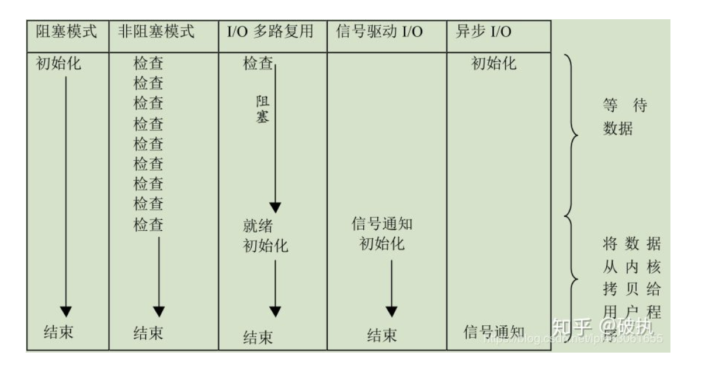

## IO模型

* 五种IO模型包括：阻塞IO、非阻塞IO、IO多路复用、信号驱动IO、异步IO

* 在Linux中，对于一次I/O读取的操作，数据并不会直接拷贝到程序的程序缓冲区。通常包括两个不同阶段：
    * 等待数据准备好，到达内核空间 (Waiting for the data to be ready) ；
    * 从内核向进程复制数据 (Copying the data from the kernel to the process)
    
## 阻塞IO

两阶段阻塞，需要等待数据准备好到达内核空间+从内核缓冲区复制到内核缓冲区


## 同步非阻塞IO

默认情况下I/O的的系统调用总是阻塞的，调用必须等待操作完成，即读写到数据才能返回。非阻塞IO使得IO操作不好永久阻塞，可以立即返回，如果操作不能当时完成，这些调用将立即返回并给出错误码，在Python中会直接抛出异常。第一个阶段不阻塞，第二阶段阻塞，需要不停轮询。

用户线程使用同步非阻塞IO模型的伪代码描述为：


```
{
    while(read(socket, buffer) != SUCCESS){
        // 轮询等待
    }
    process(buffer);
}
```

总结：这种方案可以避免等待操作完成，但是副作用是必须不断的轮询，轮询的太密集会造成CPU的浪费，太短实时性又收到影响。一般很少直接使用这种模型，而是在其他IO模型中使用非阻塞IO这一特性。

## 信号驱动IO

非阻塞I/O尽管不阻塞进程，但为了知道描述字上是否有可读的数据，进程必须采用轮询的方法不断调用read()。使用信号驱动的I/O则可以避免这种浪费资源的轮询。采用信号驱动的I/O，当在描述字上有数据到达时进程会收到一个信号，此时对该描述字进行输入输出操作将保证不会被阻塞。这样，进程便可以利用数据未到达的这段时间进行其他工作，并在确知数据已到达的情况下才发出I/O调用。正因为如此，习惯上也称信号驱动的I/O方式为异步I/O。


总结：相比非阻塞IO,信号驱动IO主动转被动,只有数据已到达才发出I/O调用，避免了不必要的轮询。

https://www.cnblogs.com/xuyh/p/3273082.html

## 多路复用IO

* 现实的情况是要同时接收来自多个输入通道的输入，并且只要有输入到达就必须接收,因此需要单个process就可以同时处理多个网络连接的IO。它的基本原理就是select/epoll这个function会不断的轮询所负责的所有socket，当某个socket有数据到达了，就通知用户进程。


* 当用户进程调用了select，那么整个进程会被block，而同时，kernel会监视所有select负责的socket，当任何一个socket中的数据准备好了，select就会返回。这个时候用户进程再调用read操作，将数据从kernel拷贝到用户进程。

* 在IO multiplexing Model中，实际中，对于每一个socket，一般都设置成为non-blocking，但是，如上图所示，整个用户的process其实是一直被block的。只不过process是被select这个函数block，而不是被socket IO给block。所以IO多路复用是阻塞在select，epoll这样的系统调用之上，而没有阻塞在真正的I/O系统调用如recvfrom之上。

* select调用详解

    ```
    #include <sys/time.h>
    #include <sys/select.h>
    
    int select(int nfds, fd_set *readfds,fd_set *writefds,fd_set *exceptfds,struct timeval *timeout);
    // 成功返回就绪的文件描述符数， 返回0表示超时，-1错误
    // readfds是用来检测输入是否就绪的文件描述符集合
    // writefds是用来检测输出是否就绪的文件描述符集合
    // exceptsfds是用来检测异常情况是否发生的文件描述集合
    ```

* 相比多线程技术：I/O多路复用技术通过把多个I/O的阻塞复用到同一个select的阻塞上，从而使得系统在单线程的情况下可以同时处理多个客户端请求。与传统的多线程/多进程模型比，I/O多路复用的最大优势是系统开销小，系统不需要创建新的额外进程或者线程，也不需要维护这些进程和线程的运行，降底了系统的维护工作量，节省了系统资源。

* 注意事项

    1. 如果处理的连接数不是很高的话，使用select/epoll的web server不一定比使用multi-threading + blocking IO的web server性能更好，可能延迟还更大。select/epoll的优势并不是对于单个连接能处理得更快，而是在于能处理更多的连接。

    2. 在多路复用模型中，对于每一个socket，一般都设置成为non-blocking，但是，如上图所示，整个用户的process其实是一直被block的。只不过process是被select这个函数block，而不是被socket IO给block。

    结论: select的优势在于可以处理多个连接，不适用于单个连接，select也是两阶段阻塞。


## 异步IO

Linux下的异步IO其实用得很少 ，著名的高性能网络框架netty 5.0版本被废弃的原因便是：使用异步IO提升效率，增加了复杂性，却并且没有显示出明显的性能优势。

* 第一阶段：当在异步 I/O 模型下时，用户进程如果想进行 I/O 操作，只需进行系统调用，告知内核要进行 I/O 操作，此时内核会马上返回， 用户进程 就可以去处理其他的逻辑了 。

* 第二阶段：当内核完成所有的 I/O 操作和数据拷贝后，内核将通知我们的程序，此时数据已经在用户空间了,可以对数据进行处理了


总结：两个阶段都不阻塞，无需等待。


## IO模型大全



前四种I/O模型都是同步I/O操作，他们的区别在于第一阶段，而他们的第二阶段是一样的。

在数据从内核复制到应用缓冲区期间（用户空间），进程阻塞于系统调用。相反，异步I/O模型在这等待数据和接收数据的这两个阶段里面都是非阻塞的，可以处理其他的逻辑，用户进程将整个IO操作交由内核完成，内核完成后会发送通知。在此期间，用户进程不需要去检查IO操作的状态，也不需要主动的去拷贝数据。

## 同步与异步、阻塞与非阻塞

同步和异步的概念描述的是用户线程与内核的交互方式【两个阶段】，同步是指用户线程发起IO请求后需要等待或者轮询内核IO操作完成后才能继续执行；而异步是指用户线程发起IO请求后仍继续执行，当内核IO操作完成后会通知用户线程，或者调用用户线程注册的回调函数。

阻塞和非阻塞的概念描述的是用户线程调用内核IO操作的方式：阻塞是指IO操作需要彻底完成后才返回到用户空间【第一个阶段数据到达内核缓冲区】；而非阻塞是指IO操作被调用后立即返回给用户一个状态值，无需等到IO操作彻底完成。

## 相关链接

* IO模型 https://zhuanlan.zhihu.com/p/95550964
* epoll的解释 https://zhuanlan.zhihu.com/p/64138532