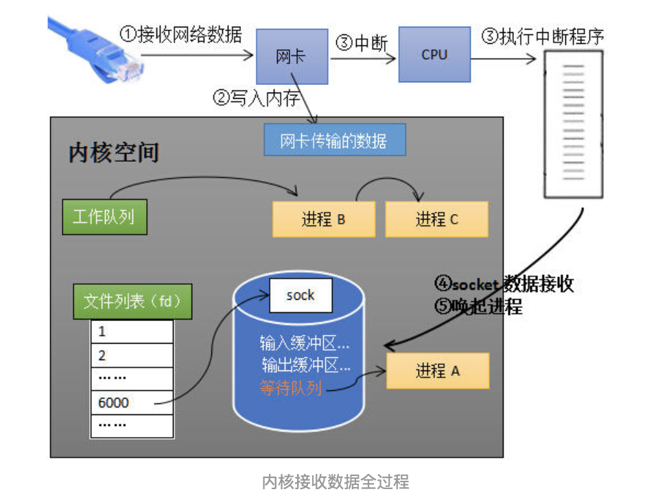
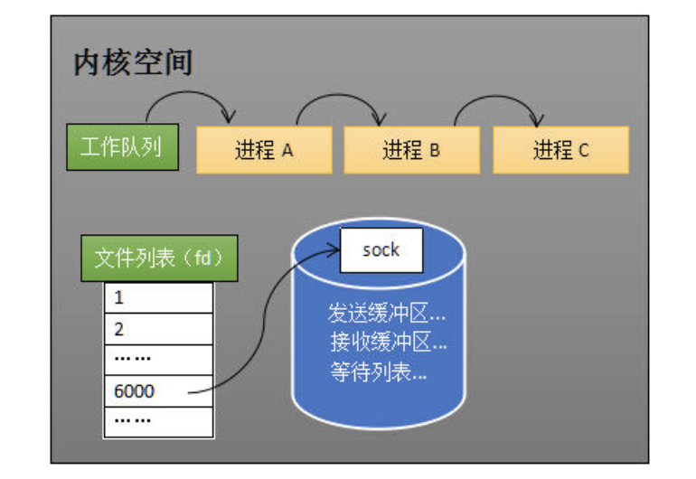
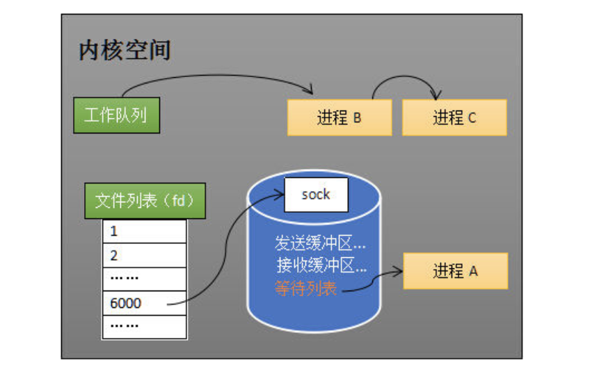
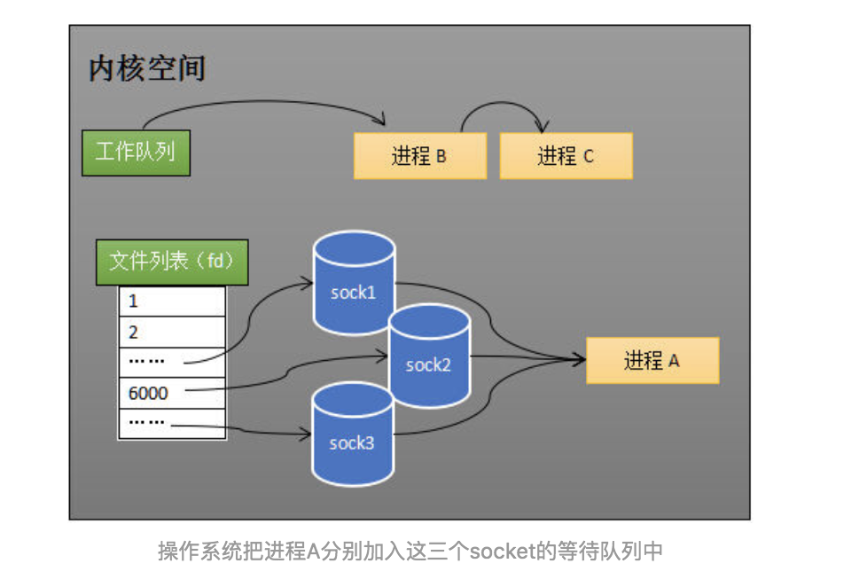

## 数据流动过程

程在recv阻塞期间，计算机收到了对端传送的数据（步骤①）。数据经由网卡传送到内存（步骤②），然后网卡通过中断信号通知cpu有数据到达，cpu执行中断程序（步骤③）。此处的中断程序主要有两项功能，先将网络数据写入到对应socket的接收缓冲区里面（步骤④），再唤醒进程A（步骤⑤），重新将进程A放入工作队列中。



## 进程与socket

```
//创建socket
int s = socket(AF_INET, SOCK_STREAM, 0);   
//绑定
bind(s, ...)
//监听
listen(s, ...)
//接受客户端连接
int c = accept(s, ...)
//接收客户端数据
recv(c, ...);
//将数据打印出来
printf(...)
```

当进程A执行到创建socket的语句时，操作系统会创建一个由文件系统管理的socket对象。这个socket对象包含了发送缓冲区、接收缓冲区、等待队列等成员。等待队列是个非常重要的结构，它指向所有需要等待该socket事件的进程。



当程序执行到recv时，操作系统会将进程A从工作队列移动到该socket的等待队列中（如下图）。由于工作队列只剩下了进程B和C，依据进程调度，cpu会轮流执行这两个进程的程序，不会执行进程A的程序。所以进程A被阻塞，不会往下执行代码，也不会占用cpu资源。



当socket接收到数据后，操作系统将该socket等待队列上的进程重新放回到工作队列，该进程变成运行状态，继续执行代码。也由于socket的接收缓冲区已经有了数据，recv可以返回接收到的数据。


## 监控多个socket

* select设计思想：预先传入一个socket列表，如果列表中的socket都没有数据，挂起进程，直到有一个socket收到数据，唤醒进程select的实现思路很直接。假如程序同时监视如下图的sock1、sock2和sock3三个socket，那么在调用select之后，操作系统把进程A分别加入这三个socket的等待队列中。当任何一个socket收到数据后，中断程序将唤起进程。所谓唤起进程，就是将进程从所有的等待队列中移除，加入到工作队列里面。程序只需遍历一遍socket列表，就可以得到就绪的socket。



* 总结
    * 每次调用select都需要将进程加入到所有监视socket的等待队列，每次唤醒都需要从每个队列中移除。这里涉及了两次遍历，而且每次都要将整个fds列表传递给内核，有一定的开销。正是因为遍历操作开销大，出于效率的考量，才会规定select的最大监视数量，默认只能监视1024个socket。
    * 进程被唤醒后，程序并不知道哪些socket收到数据，还需要遍历一次。
    
## epoll

* 优化思路

    * 功能分离：select低效的原因之一是将“维护等待队列”和“阻塞进程”两个步骤合二为一。如下图所示，每次调用select都需要这两步操作，然而大多数应用场景中，需要监视的socket相对固定，并不需要每次都修改。epoll将这两个操作分开，先用epoll_ctl维护等待队列，再调用epoll_wait阻塞进程。显而易见的，效率就能得到提升。
    
    * 就绪列表：select低效的另一个原因在于程序不知道哪些socket收到数据，只能一个个遍历。如果内核维护一个“就绪列表”，引用收到数据的socket，就能避免遍历。
    
## 相关链接

https://zhuanlan.zhihu.com/p/64746509