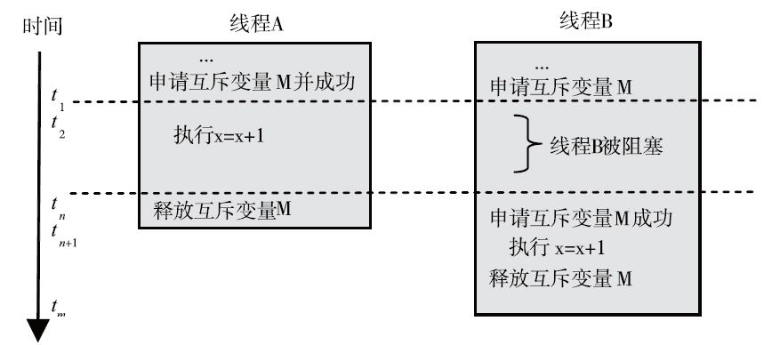
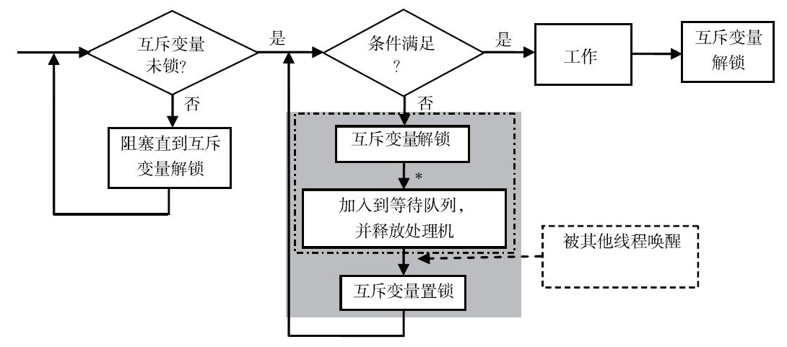

##LOCK

* 互斥变量主要用于多个线程竞争访问某个共享资源。多线程程序中，共享数据的读写必须是原子的。也就是说，一个线程在读或写某个共享数据期间，不希望受到其他线程的干扰，否则将发生不可预知的结果。每次只有一个线程执行，也就是互斥执行。
* 互斥变量只有两种状态：已锁或未锁，故也称互斥变量为互斥锁。对于“锁”这个概念我们应当很熟悉，互斥变量表示的逻辑概念就是锁。线程对一个互斥变量加锁，只有在该变量处于未锁状态时才能成功返回，否则将受阻直至互斥变量被释放。试图获得同一个互斥变量的其他线程将被阻塞。
* 已锁住的互斥变量必须由获得它的线程释放才能恢复为未锁状态。当它被释放后，等待获得该互斥变量的线程之一将获得成功。


```
# 一旦一个线程获得一个锁，会阻塞随后尝试获得锁的线程，直到它被释放；
pthread_mutex_t lock;
pthread_mutex_lock(&lock);
x = x + 1; # 临界区
pthread_mutex_unlock(&lock);
```

* 处理上锁失败的情况：线程对互斥变量上锁不成功时，系统可以有三种方法来使线程阻塞：a）立即阻塞，即释放线程占用的CPU资源，使其从运行状态进入等待状态；b）让线程在一个循环中轮询查看是否能获得互斥变量，如果一段时间后仍未成功，则进入阻塞；c）在一个循环中不断地轮询，直到获得互斥变量。
    * 单处理机系统通常采用第一种方法，因为系统只有一个处理机，轮询既浪费CPU时间，也妨碍占有互斥变量的线程释放该互斥变量。
    * 多处理机或多核系统可以使用三种方法之一，一般多采用立即阻塞或者轮询一段时间后阻塞。    



* spin锁:在多处理机环境中，如果程序对某个共享数据的操作时间极短，我们可能会希望上锁受阻时采用轮询的方法，因为这样做效率可能会更高：线程不需要切换，因而没有切换开销。特别是一般多处理机系统都有支持这种轮询的特殊测试指令，如test and set指令，在这种系统上实现轮询只需要简单的一条指令即可。针对这种情况，POSIX扩充了spin锁接口【轮询方案】。


```
 test and set指令：返回旧值并更新新值【原子指令】
```

* spin锁与互斥锁的比较

    * 信号量mutex是sleep-waiting。 就是说当没有获得mutex时，会有上下文切换，将自己、加到忙等待队列中，直到另外一个线程释放mutex并唤醒它，而这时CPU是空闲的，可以调度别的任务处理。
    * 自旋锁spin lock是busy-waiting。就是说当没有可用的锁时，就一直忙等待并不停的进行锁请求，直到得到这个锁为止。这个过程中cpu始终处于忙状态，不能做别的任务。例如在一个双核的机器上有两个线程(线程A和线程B)，它们分别运行在Core0 和Core1上。 用spin-lock，coer0上的线程就会始终占用CPU。另外一个值得注意的细节是spin lock耗费了更多的user time。这就是因为两个线程分别运行在两个核上，大部分时间只有一个线程能拿到锁，所以另一个线程就一直在它运行的core上进行忙等待，CPU占用率一直是100%；而mutex则不同，当对锁的请求失败后上下文切换就会发生，这样就能空出一个核来进行别的运算任务了。
    
    * 总结：1）Mutex适合对锁操作非常频繁的场景，并且具有更好的适应性。尽管相比spin lock它会花费更多的开销（主要是上下文切换），但是它能适合实际开发中复杂的应用场景，在保证一定性能的前提下提供更大的灵活度。2）spin lock的lock/unlock性能更好(花费更少的cpu指令)，但是它只适应用于临界区运行时间很短的场景。而在实际软件开发中，除非程序员对自己的程序的锁操作行为非常的了解，否则使用spin lock不是一个好主意(通常一个多线程程序中对锁的操作有数以万次，如果失败的锁操作(contended lock requests)过多的话就会浪费很多的时间进行空等待)。3）更保险的方法或许是先（保守的）使用 Mutex，然后如果对性能还有进一步的需求，可以尝试使用spin lock进行调优。毕竟我们的程序不像Linux kernel那样对性能需求那么高(Linux Kernel最常用的锁操作是spin lock和rw lock)。
    
    * 混合futexes：其工作方式是，线程进行比较和交换，如果失败，它将首先旋转一小段固定的次数，如果仍然没有被标记，则线程才被挂起。这些混合futex非常聪明，这是pthread Mutex的变体，使用了混合futex。Go具有内部futex实现，这是一个混合futex。
    
* 锁的本质：锁的本质所谓的锁，在计算机里本质上就是一块内存空间。当这个空间被赋值为1的时候表示加锁了，被赋值为0的时候表示解锁了，仅此而已。多个线程抢一个锁，就是抢着要把这块内存赋值为1。在一个多核环境里，内存空间是共享的。每个核上各跑一个线程，那如何保证一次只有一个线程成功抢到锁呢？这必须要硬件的某种guarantee。

* Golang的锁：Go运行时将把goroutine添加到等待队列中，在这种情况下，等待队列是在用户空间中管理的。等待队列看起来与futex等待队列非常相似。我们有一个哈希表，每个哈希存储区都有一个等待队列。等待队列本身的详细信息略有不同，但是今天的详细信息不再重要。将goroutine添加到等待队列后，Go运行时将通过调用Go调度程序来对goroutine进行调度。goroutine被挂起，但是基础线程继续运行，而基础线程只是选择了其他goroutine来运行。当编写器出现时，它完成了它的工作，Go运行时遍历了等待队列,没有上下文切换的开销。


##读写锁

* 共享读互斥写的锁：尽管spin锁提高了多处理机下细粒度共享数据访问的性能，但互斥变量和spin锁都只支持严格的互斥——受其保护的关键区代码任何时候都只能有一个线程执行。这种严格的锁机制有时会导致多线程并发程序蜕化成串行执行。读写锁是专门设计用来改善程序并行性的一种锁机制，它支持线程对共享数据的共享读互斥写，主要用于保护读操作频繁但写操作很少的共享数据。

* 具体的工作方式：读写锁的上锁操作分为读方式上锁和写方式上锁：读写锁被一个线程以读方式占有后，仍然允许其他线程以读方式占有；但是，每次只允许一个线程获得锁来写共享数据。线程企图以写方式占有锁时，如果当前锁被其他线程占有，不论它是以读还是以写方式被占有，线程都将受阻；线程企图以读方式占有锁时，如果锁已被其他线程以写方式占有，线程也将受阻。

```
Note:这种机制使得既能保护共享数据读写的一致性，又可以使读操作并行执行。
尽管读写锁可以提高并行性，但其上锁和解锁操作比互斥变量开销要大。【内部实现是三把互斥锁】
因此，在选择使用读写锁还是互斥变量时要注意综合考虑应用程序的性能。
```

* python读写锁实现：https://pypi.org/project/readerwriterlock/ 

##条件变量

* 互斥变量给线程提供了互斥访问共享数据的手段，用它可保证对共享数据访问的一致性。但是，多线程应用还经常会遇到另外一种较为复杂的情况：当线程访问某个共享数据时，不仅仅需要互斥，而且还要求这个共享数据满足某种状态或条件，如果其他线程不改变这个状态，它就无法继续处理。

* 条件变量是利用线程间共享的全局变量进行同步的一种机制，主要包括两个动作：一个线程等待"条件变量的条件成立"而挂起；另一个线程使"条件成立"（给出条件成立信号）。为了防止竞争，条件变量的使用总是和一个互斥锁结合在一起。


* 条件变量的实现：它必须能够在条件满足时使自己脱离等待状态，也就是被唤醒。线程实现等待唤醒可以有两种方法。一种方法是轮询队列产品计数，当计数不为0时自动脱离等待状态。但是，这样线程就会总是占据着CPU，浪费CPU时间，并且当线程个数大于可用的CPU个数时，还会极其低效，通常不采用这种方法。另一种方法是将自己加入到一个等待队列，然后阻塞自己并等待被生产线程唤醒。



```
自动释放该互斥变量并保证与等待动作一起构成原子操作,否则可能导致线程不知道条件已经满足了
```

```
int pthread_cond_wait(pthread_cond_t *cond, pthread_mutex_t *mutex);
int pthread_cond_signal(pthread_cond_t *cond);
条件变量总是与某种类型的锁对象相关联，当调用上述任何一个例程时，这把锁应该锁住。
```

* 条件变量服从 上下文管理协议：使用 with 语句会在它包围的代码块内获取关联的锁。 acquire() 和 release() 方法也能调用关联锁的相关方法。

* 其它方法必须在持有关联的锁的情况下调用。 wait() 方法释放锁，然后阻塞直到其它线程调用 notify() 方法或 notify_all() 方法唤醒它。一旦被唤醒， wait() 方法重新获取锁并返回。它也可以指定超时时间。

##相关链接

https://www.zhihu.com/question/332113890/answer/1052024052

https://blog.csdn.net/zixiao217/article/details/77063332?utm_source=blogxgwz3

https://www.infoq.com/presentations/go-locks/