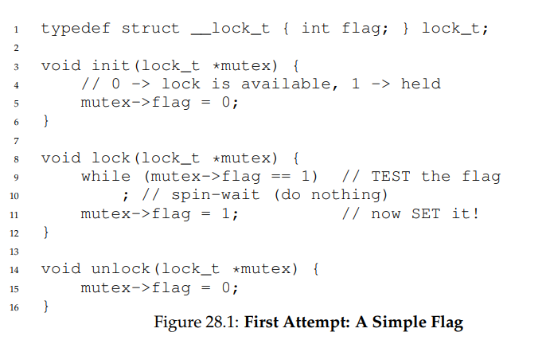
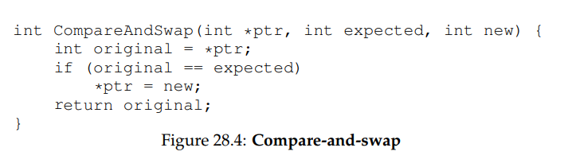

## 锁的基本思想

* 锁的本质就是一个变量，这个变量代表某一个时刻的状态，可用或者占用

* lock和unlock的语义比较简单，获取锁和释放锁，锁提供了最小程度的调度控制，
使得对临界区的是可控的。

## 考虑实现一个锁

需要硬件和操作系统的帮助来实现一个可用的锁。

## 如何评价锁

* 基本任务：提供互斥，保证只有一个线程进入临界区。

* 公平性：每一个线程都有公平的机会获得锁，不会出现线程等待很久都获取不到锁的情况。

* 性能：吞吐量，单个CPU和多个CPU不同的性能表现。

## 关中断实现

```
 void lock() {
    DisableInterrupts();
 }
 void unlock() {
    EnableInterrupts();
 }
 ```

最早提供的互斥解决方案是在临界区关中断，避免上下文切换，保证临界区代码不会被中断
从而原子的执行，然而缺点众多：

* 不支持多处理器：运行在不同的CPU上，使得多个线程进入临界区。

* 关中断导致中断丢失：可能导致严重的系统问题。

* 不可控：临界区如果很长就麻烦了，由于是执行用户的代码，可能导致长时间关中断

## 原子交换【atomic exchange】实现

* 测试并设置：依赖原子交换执行执行锁，返回旧值【测试旧值】同时更新新值【设置新值】
，并且是原子地执行。



* 自旋锁：上述这种锁实现也称之为自旋锁，一直自旋，直到锁可用，比较耗费CPU。
    * 正确性满足但是不公平，存在永远自旋的可能。
    * 单CPU开销很大多CPU性能尚可。
    
## 比较并交换

某些系统提供另一种硬件原语，即比较并交换指令。



基于比较并交换实现一个锁，和测试并设置类似
 ```
void lock(lock_t *lock) {
    while (CompareAndSwap(&lock->flag, 0, 1) == 1)
        ; // spin
    }
 }
  ```
  

