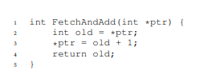
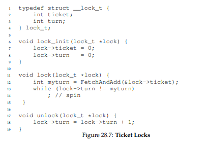
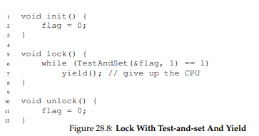
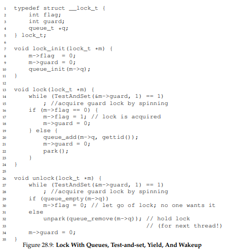

## 锁的基本思想

* 锁的本质就是一个变量，这个变量代表某一个时刻的状态，可用或者占用

* lock和unlock的语义比较简单，获取锁和释放锁，锁提供了最小程度的调度控制，
使得对临界区的是可控的。

## 考虑实现一个锁

需要硬件和操作系统的帮助来实现一个可用的锁。

## 如何评价锁

* 基本任务：提供互斥，保证只有一个线程进入临界区。

* 公平性：每一个线程都有公平的机会获得锁，不会出现线程等待很久都获取不到锁的情况。

* 性能：吞吐量，单个CPU和多个CPU不同的性能表现。

## 关中断实现

```
 void lock() {
    DisableInterrupts();
 }
 void unlock() {
    EnableInterrupts();
 }
 ```

最早提供的互斥解决方案是在临界区关中断，避免上下文切换，保证临界区代码不会被中断
从而原子的执行，然而缺点众多：

* 不支持多处理器：运行在不同的CPU上，使得多个线程进入临界区。

* 关中断导致中断丢失：可能导致严重的系统问题。

* 不可控：临界区如果很长就麻烦了，由于是执行用户的代码，可能导致长时间关中断

## 原子交换【atomic exchange】实现

* 测试并设置：依赖原子交换执行执行锁，返回旧值【测试旧值】同时更新新值【设置新值】
，并且是原子地执行。


* 自旋锁：上述这种锁实现也称之为自旋锁，一直自旋，直到锁可用，比较耗费CPU。
    * 正确性满足但是不公平，存在永远自旋的可能。
    * 单CPU开销很大多CPU性能尚可。
    
## CAS比较并交换

某些系统提供另一种硬件原语，即比较并交换指令。


基于比较并交换实现一个锁，和测试并设置类似
 ```
void lock(lock_t *lock) {
    while (CompareAndSwap(&lock->flag, 0, 1) == 1)
        ; // spin
    }
 }
  ```
 ## FetchAndAdd 获取并增加 
 
 不同于之前的方法，使用这个硬件原语实现的锁，保证所有线程都能得到锁，并且比较公平。
 



## 锁的优化

* 自旋过多：一直自旋会一直占用CPU,直到整个时间片都用完了。最糟糕的情况是N个线程同时竞争锁，
这会浪费N-1个时间片。

* 让出CPU:获取锁失败的时候，就让出CPU，切换到另一个线程。但是如果很多线程竞争锁，可能导致
频繁地上下文切换，并且一个线程也可能一直处于让出的状态。



* 休眠代替自旋：使用队列来保存一个等待锁的线程，利用park和unpark调用，前者用于让
某个线程休眠后者用于唤醒一个线程。



guard起到了自旋的作用，但是很快就不会自旋了，获取锁失败会将相关的线程加入到一个队列中。

由于之前的代码是先guard=0再park,如果在park调用之前切换到另一个线程，可能导致这个线程永远睡下去，
因此下面做了改进，setpark一个线程表明自己要park，如果另一个线程被调度调用了unpark，那么
后续的park调用就会直接返回而不是睡眠。
 ```
queue_add(m->q, gettid());
setpark(); // new code
m->guard = 0;
 ```
 
 

## 两阶段锁

第一个阶段先自旋一段时间，第二个阶段会睡眠直到锁可用，这是一个hybrid方案。


## python锁实现
锁的底层是c语言的信号量，利用信号量可以实现锁和条件变量，sem_init(sem_t *sem, int pshared, unsigned int value)
信号量的值是1并且不是进程共享的，放置在这个进程的所有线程都可见的地址上。

https://www.jianshu.com/p/e84b2d201b40