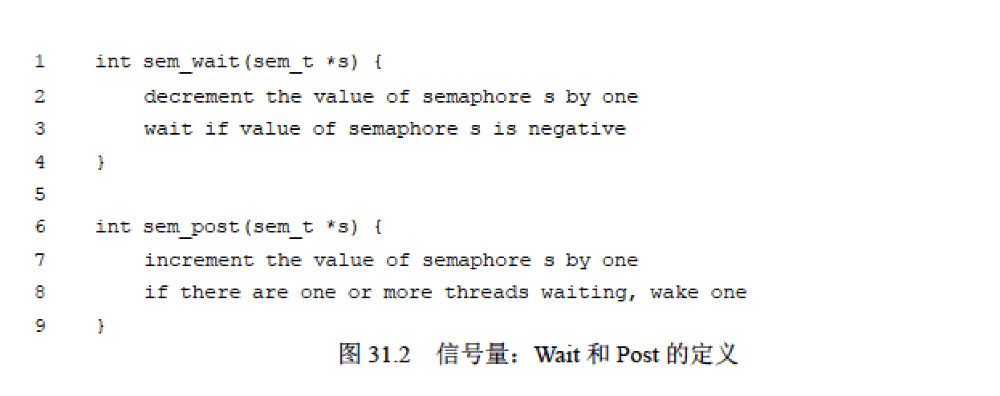
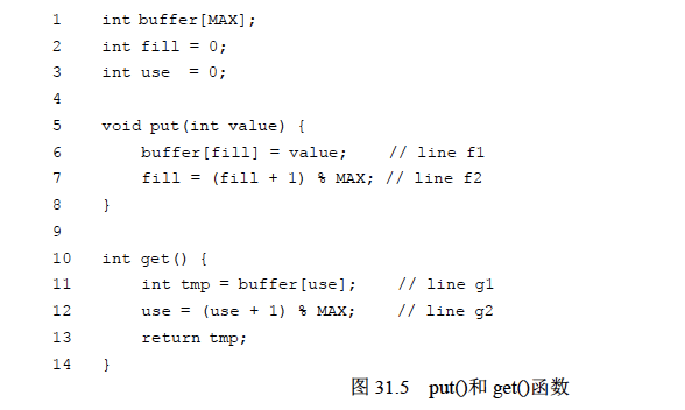
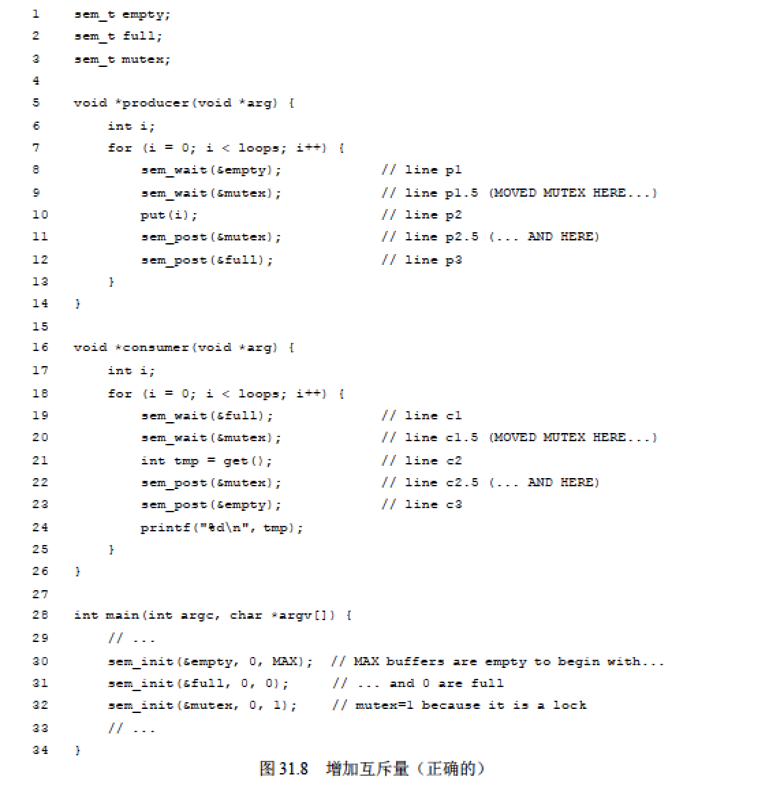

## 信号量

* 概念：信号量(Semaphore)机制是一种卓有成效的进程同步工具。可以使用信号量作为锁和条件变量。信号量是有一个整数值的对象，可以用两个函数来操作它。在POSIX 标准中，是sem_wait()和sem_post()。因为信号量的初始值能够决定其行为，所以首先要初始化信号量，才能调用其他函数与之交互。信号量初始化之后，可以调用sem_wait()或sem_post()与之交互。
```
#include <semaphore.h>
sem_t s;
sem_init(&s, 0, 1);
    int sem_init(sem_t *sem, int pshared, unsigned int value);
    sem 指向信号量对象、pshared 指明信号量的类型。不为0在进程间共享，否则只线程共享。value指定信号量值的大小
```



* 过程：首先，sem_wait()要么立刻返回（调用sem_wait()时，信号量的值大于等于1），要么会让调用线程挂起，直到之后的一个post 操作。当然，也可能多个调用线程都调用sem_wait()，因此都在队列中等待被唤醒。其次，sem_post()并没有等待某些条件满足。它直接增加信号量的值，如果有等待线程，唤醒其中一个。最后，当信号量的值为负数时，这个值就是等待线程的个数。

* 信号量实现锁：用信号量作为锁，value=1即可。

* 信号量实现条件变量：信号量也可以用在一个线程暂停执行，等待某一条件成立的场景，value=0即可。

* 信号量实现生产者和消费者问题：两个信号量empty,full,value分别为n和0




## 如何信号量

用底层的同步原语（锁和条件变量），来实现自己的信号量，名字叫作Zemaphore。

